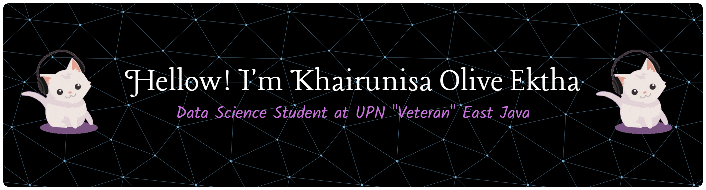

---

<picture>
  <source media="(prefers-color-scheme: dark)" srcset="https://raw.githubusercontent.com/Qozuu/Qozuu/output/pacman-contribution-graph-dark.svg">
  <source media="(prefers-color-scheme: light)" srcset="https://raw.githubusercontent.com/Qozuu/Qozuu/output/pacman-contribution-graph.svg">
  
</picture>

<!-- Proudly created with GPRM ( https://gprm.itsvg.in ) -->

<!--

**Qozuu/Qozuu** is a ✨ _special_ ✨ repository because its `README.md` (this file) appears on your GitHub profile.
